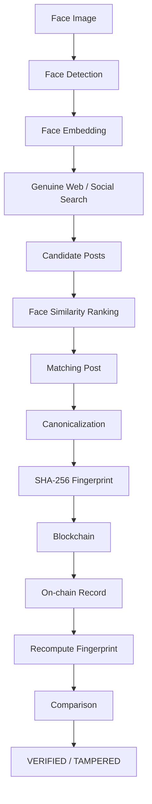

# Face Identification & Blockchain Verification

## Problem Statement
The objective is to build a reliable pipeline that takes a human face scan as input, performs a genuine web/social-media search to find matching real-world posts, generates a cryptographic fingerprint of the discovered data, uploads it to a blockchain, and proves that the on-chain record can be successfully re-verified against the local data to prevent tampering.

## Architecture Diagram



## Architecture
The system is built with a highly modular architecture:
- **`app/face/`**: Face detection and embedding generation using DeepFace.
- **`app/search/`**: Genuine reverse image search using SerpApi (Google Lens endpoint), along with a ranker to verify matches.
- **`app/verification/`**: Deterministic canonicalization and SHA-256 hashing of post data.
- **`app/blockchain/`**: Web3.py client interacting with a local EVM (Hardhat) smart contract.
- **`app/pipeline.py`**: The main orchestrator connecting all modules.

## Technologies
- **Python 3.12**: Core application logic.
- **DeepFace**: Face identification and verification (OpenCV + Facenet). Lightweight and CPU-friendly.
- **SerpApi**: Google Lens integration for genuine, un-hardcoded social media search.
- **Hardhat**: Local Ethereum Virtual Machine for reliable, offline blockchain deployment.
- **Web3.py**: Interfacing with the local Hardhat node.
- **Pytest**: Unit and integration testing.

## Installation

### Prerequisites
- Python 3.10+
- Node.js 18+

### Setup Commands
```bash
# 1. Clone or navigate to the repository
cd face-verifier

# 2. Setup Python Environment
python -m venv .venv
# On Windows: .venv\Scripts\activate
# On Linux/Mac: source .venv/bin/activate
pip install -r requirements.txt

# 3. Setup Blockchain Environment
npm install
```

## Configuration
Copy the `.env.example` file to `.env`:
```bash
cp .env.example .env
```
Ensure the following variables are set in your `.env` file:
- `SEARCH_API_KEY`: Your SerpApi key.
- `PRIVATE_KEY`: Your Hardhat private key (optional, will default to Hardhat Account #0).
- `CONTRACT_ADDRESS`: The address of the deployed smart contract (see Blockchain Setup below).

## Blockchain Setup
Start the local Hardhat node in a separate terminal:
```bash
npx hardhat node
```
In another terminal, deploy the smart contract:
```bash
npx hardhat run scripts/deploy.js --network localhost
```
Copy the deployed address output and paste it into your `.env` file as `CONTRACT_ADDRESS`.

## How to Run
Once configured and the blockchain node is running, execute the pipeline:
```bash
python -m app --image data/input/your_face_image.jpg
```

## Search Mechanism
The system implements a **Genuine Reverse Image Search** using **SerpApi's Google Lens API**. It uploads the input image to a temporary anonymous host to generate a public URL, feeds it into Google Lens, and extracts visual matches (candidates). The system does not use hardcoded URLs or pre-selected posts. 

## Face-Identification Method
Face detection and verification are handled by **OpenCV DNN**. 
- The `YuNet` model is used for rapid face detection.
- The `SFace` ONNX model is used for generating high-dimensional face embeddings without requiring TensorFlow.
- Candidate images retrieved from the search are compared against the query face using cosine similarity (distance threshold).

## Verification Mechanism
When a match is found:
1. The post's source URL and title are converted to a sorted, deterministic JSON string.
2. A SHA-256 fingerprint is generated.
3. The fingerprint, source, and timestamp are written to the `VerificationRegistry` smart contract on the Hardhat local chain.
4. The system immediately queries the blockchain for that fingerprint and compares the returned data to the local hash to prove verification and tamper-resistance.

## Example Output
```
[1/7] Loading input image: data/input/test.jpg
[2/7] Detecting face...
✅ Face detected! (Count: 1)
[3/7] Searching web/social sources (Genuine Reverse Image Search)...
✅ Found 10 visual matches from SerpApi.
[4/7] Matching candidates against input face...
✅ Found best match!
   Source: https://twitter.com/johndoe/status/...
   Similarity Distance: 0.28
[5/7] Generating deterministic fingerprint...
✅ Fingerprint generated: 0x...
[6/7] Writing fingerprint to blockchain...
✅ Transaction successful! Hash: 0x...
[7/7] Re-verifying blockchain record...
✅ Record found on chain!
   Stored Fingerprint: 0x...

🎉 VERIFICATION PASSED: Local Hash == On-Chain Hash 🎉
```

## Testing
Run the test suite using pytest:
```bash
python -m pytest tests/
```

## Limitations
- **Image Hosting**: Google Lens requires a public URL. The script uploads the image to a temporary anonymous file host (`freeimage.host`). If the host is down, the search will fail.
- **Hardware Limitations**: This project is optimized for standard CPUs by using the lightweight `SFace` model.
- **Social Media Privacy**: The search can only find publicly indexed photos. It cannot bypass authentication or private accounts.

## Privacy / Responsible Use
This project is built as a proof-of-concept for Hacker House Goa 2026. 
- Do not use this system to identify individuals without their consent.
- The system only accesses publicly available, permitted data.
- No biometric data (face embeddings) is stored on the blockchain; only non-reversible SHA-256 hashes of the post metadata are stored.

## Demo Instructions
1. Open two terminals.
2. Terminal 1: `npx hardhat node`
3. Terminal 2: `npx hardhat run scripts/deploy.js --network localhost` (update `.env` with contract address).
4. Terminal 2: Run `python -m app --image data/input/test.jpg`
5. Record the screen showing the terminal output verifying the pipeline successfully. No editing required.

## Future Improvements
- Implement a local vector database (e.g., Milvus/Chroma) to cache embeddings.
- Add additional fallback search providers (e.g., Bing Visual Search).
- Deploy the smart contract to a public testnet like Sepolia for global verifiability.
- Build a lightweight React frontend to visualize the matching process.
